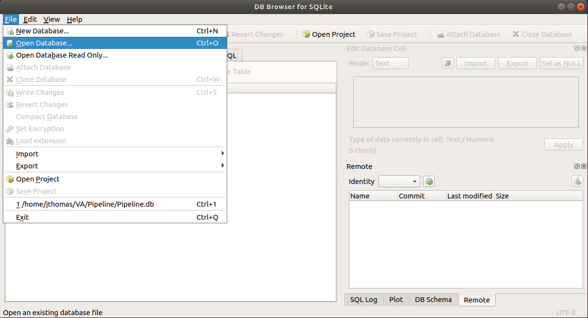
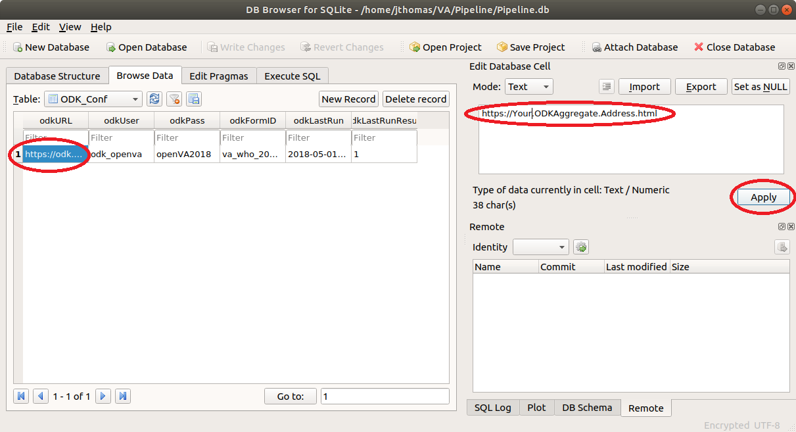

# Software Requirements & Installation Guide for Ubuntu Server 20.04

Note: To make the installation process easier, all of the required software can be installed by downloading and running the bash script [install_software.sh](https://raw.githubusercontent.com/D4H-CRVS/OpenVA_Pipeline/master/install_software.sh) located in the main folder of this repository.

1. The following software is required by the openVA pipeline: [Python 3.6 (or higher)]((https://www.python.org/downloads/)),
   [OpenJDK](http://openjdk.java.net) (or [Java JDK 7 or 8]()), [R](https://cran.r-project.org), [SQLite3](https://www.sqlite.org),
   and [SQLCipher](https://github.com/sqlcipher/sqlcipher).  For installation purposes, it is also useful to install
   [PIP](https://pypi.python.org/pypi/pip) (tool for installing Python packages).
    - Installation on Ubuntu 20.04: run the following commands at a terminal promp (indicated by $)

    ~~~~~~~~~~~~~~~~~~~~~~~~~~~~~~~~~~~~~~~~~~{.bash}
    $ sudo apt update
    $ sudo apt install python3-pip openjdk-11-jdk r-base sqlite3 libsqlite3-dev sqlcipher libsqlcipher-dev curl libcurl4-openssl-dev -y
    ~~~~~~~~~~~~~~~~~~~~~~~~~~~~~~~~~~~~~~~~~~

1. [ODK Briefcase](https://github.com/opendatakit/briefcase/releases): Version v1.18.0 (previous versions may not work
   with the pipeline). Download the `ODK-Briefcase-v1.18.0.jar` file to the same folder where _pipeline.py_
   is located.
1. [R Package](https://cran.r-project.org/web/packages/available_packages_by_name.html):
[openVA](https://cran.r-project.org/web/packages/openVA/index.html)
Within R (to start R, simply type ```R``` at a terminal prompt, or ```sudo R``` for system-wide installation of packages), the
necessary packages can be installed (with internet connection) using the following command:

    ~~~~~~~~~~~~~~~~~~~~~~~~~~~~~~~~~~~~~~~~~~{.r}
    > install.packages("openVA")
    ~~~~~~~~~~~~~~~~~~~~~~~~~~~~~~~~~~~~~~~~~~

   Note that `>` in the previous command indicates the R prompt (not part of the actual command).  This command will
    prompt the user to select a CRAN mirror (choose a mirror close to your geographic location).  After the installation
    of the packages has been completed, you can exit R with the following command:
    
    ~~~~~~~~~~~~~~~~~~~~~~~~~~~~~~~~~~~~~~~~~~{.r}
    > q('no')
    ~~~~~~~~~~~~~~~~~~~~~~~~~~~~~~~~~~~~~~~~~~

1. [Python packages](https://pypi.org/) & updates
    - installation for Ubuntu 20.04: Python 3.8 is pre-installed, but additional packages and modules are needed, which can 
      be installed with the following command at a terminal:

        ~~~~~~~~~~~~~~~~~~~~~~~~~~~~~~~~~~~~~~~~~~{.bash}
        $ pip3 install --upgrade pip --user
        $ pip3 install --upgrade setuptools --user
        $ pip3 install openva-pipeline --user
        ~~~~~~~~~~~~~~~~~~~~~~~~~~~~~~~~~~~~~~~~~~
        
        Note: the first command: `pip3 install --upgrade pip --user` will produce a warning message:
        
        > You are using pip version 8.1.1, however version 10.0.1 is available.               
        > You should consider upgrading via the 'pip install --upgrade pip' command.
        
        However, after running the command `hash -d pip3`, the command `pip3 --version` shows that version 10.0.1 is indeed installed. 

1. [DB Browser for SQLite](https://github.com/sqlitebrowser/sqlitebrowser/blob/master/BUILDING.md): this optional tool
is useful for configuring the SQLite Database and can be installed using the following commands:

    ~~~~~~~~~~~~~~~~~~~~~~~~~~~~~~~~~~~~~~~~~~{.bash}
    $ sudo apt update
    $ sudo apt install sqlitebrowser -y
    ~~~~~~~~~~~~~~~~~~~~~~~~~~~~~~~~~~~~~~~~~~

# Pipeline Setup

1. **SQLite database**: The openVA pipeline uses an SQLite database to access configuration settings for ODK Aggregate, openVA in R, and DHIS2. Error and log messages are also stored to this database, along with the VA records downloaded from ODK Aggregate and the assigned COD       
   1. The necessary tables and schema are created in the SQL file pipelineDB.sql, which can be downloaded from the [OpenVA_Pipeline GitHub webpage](https://github.com/D4H-CRVS/OpenVA_Pipeline/pipelineDB.sql). Create the SQLite database in the same folder as the file _pipeline.py_.  
   1. Use SQLCipher to create the pipeline database, assign an encryption key, and populate the database using the following commands (note that the `$` is the terminal prompt and `sqlite>` is the SQLite prompt, i.e., not part of the commands).
       
      ~~~~~~~~~~~~~~~~~~~~~~~~~~~~~~~~~~~~~~~~~~{.bash}
      $ sqlcipher
      sqlite> .open Pipeline.db
      sqlite> PRAGMA key=encryption_key;
      sqlite> .read "pipelineDB.sql"
      sqlite> .tables
      sqlite> -- take a look --
      sqlite> .schema ODK_Conf
      sqlite> SELECT odkURL from ODK_Conf
      sqlite> .quit
      ~~~~~~~~~~~~~~~~~~~~~~~~~~~~~~~~~~~~~~~~~~~~~~~~~~~
    
      Note how the pipeline database is encrypted, and can be accessed via with SQLite command: <br/> `PRAGMA key = "encryption_key;"`

      ~~~~~~~~~~~~~~~~~~~~~~~~~~~~~~~~~~~~~~~~~~{.bash}
      $ sqlcipher
      sqlite> .open Pipeline.db
      sqlite> .tables

      Error: file is encrypted or is not a database

      sqlite> PRAGMA key = "encryption_key";
      sqlite> .tables
      sqlite> .quit
      ~~~~~~~~~~~~~~~~~~~~~~~~~~~~~~~~~~~~~~~~~~~~~~~~~~~
   1. Open the file _pipeline.py_ and edit the first two lines of code by including the name of the pipeline SQLite database (the default is _Pipeline.db_) and the encryption password.  The lines in _pipeline.py_ are:

    ~~~~~~~~~~~~~~~~~~~~~~~~~~~~~~~~~~~~~~~~~~{.python}
    #----------------------------------------------------------------------#
    # User Settings
    sqlitePW = "enilepiP"
    dbName   = "Pipeline.db"
    #----------------------------------------------------------------------#
    ~~~~~~~~~~~~~~~~~~~~~~~~~~~~~~~~~~~~~~~~~~~~~~

1. **Configure Pipeline**: The pipeline connects to ODK Aggregate and DHIS2 servers and thus requires usernames, passwords, and URLs.  Arguments for openVA should also be supplied. We will use [DB Browser for SQLite](https://github.com/sqlitebrowser/sqlitebrowser/blob/master/BUILDING.md) to configure these settings. Start by launching DB Browser from the terminal, which should open the window below `$ sqlitebrowser`
    
   
    
   Next, open the database by selecting the menu options: _File_ -> _Open Database..._
    
   
    
   and navigate to the _Pipeline.db_ SQLite database and click the _Open_ button.  This will prompt you to enter in encryption password.
    
   
    
   1. **ODK Configuration**: To configure the pipeline connection to ODK Aggregate, click on the _Browse Data_ tab and select the ODK_Conf table as shown below.
       
      
      
      
       
      Now, click on the <em>odkURL</em> column, enter the URL for your ODK Aggregate server, and click <em>Apply</em>.
       
      
       
      Similarly, edit the <em>odkUser</em>, <em>odkPass</em>, and <em>odkFormID</em> columns so they contain a valid user name, password, and Form ID (see Form Management on ODK Aggregate server) of the VA questionnaire of your ODK Aggregate server.
    
   1. **openVA Configuration**: The pipeline configuration for openVA is stored in the <em>Pipeline_Conf</em> table. Follow the steps described above (in the ODK Aggregate Configuration section) and edit the following columns:
      - __workingDirectory__ -- the directory where the pipeline files (i.e., _pipeline.py_, _Pipeline.db_ and the ODK Briefcase application, _ODK-Briefcase-v1.10.1.jar_).  Note that the pipeline will create new folders and files in this working directory, and must be run by a user with privileges for writing files to this location.   
      - __openVA_Algorithm__ -- currently, there are only two acceptable values for the alogrithm are `InterVA` or `Insilico`
      - __algorithmMetadataCode__ -- this column captures the necessary inputs for producing a COD, namely the VA questionnaire, the algorithm, and the symptom-cause information (SCI) (see [below](#SCI) for more information on the SCI).  Note that there are also different versions (e.g., InterVA 4.01 and InterVA 4.02, or WHO 2012 questionnare and the WHO 2016 instrument/questionnaire).  It is important to keep track of these inputs in order to make the COD determination reproducible and to fully understand the assignment of the COD.  A list of all _algorithmMetadataCodes_ is provided in the _dhisCode_ column in the _Algorithm_Metadata_Options_ table.  The logic for each code is </br> algorith|algorithm version|SCI|SCI version|instrument|instrument version.
      - __codSource__ -- both the InterVA and InSilicoVA algorithms return CODs from a list produced by the WHO, and thus this column should be left at the default value of `WHO`.
   1. **DHIS2 Configuration**: The pipeline configuration for DHIS2 is located in the _DHIS\_Conf_ table, and the following columns should be edited with appropriate values for your DHIS2 server.
      - __dhisURL__ --  the URL for your DHIS2 server 
      - __dhisUser__ -- the username for the DHIS2 account
      - __dhisPass__ -- the password for the DHIS2 account
      - __dhisOrgUnit__ -- the Organization Unit (e.g., districts) UID to which the verbal autopsies are associated. The organisation unit must be linked to the Verbal Autopsy program.  For more details, see the DHIS2 Verbal Autopsy program [installation guide](https://github.com/SwissTPH/dhis2_va_draft/blob/master/docs/Installation.md)
# Miscellaneous notes

## <a name="SCI"> Symptom-Cause Information </a>

A key component of automated cause assignment methods for VA is the symptom-cause information (SCI) that describes how VA symptoms are
related to each cause. It is likely that the relationships of VA symptoms to causes vary in important ways across space and
between administrative jurisdictions, and they are likely to change through time as new diseases and conditions emerge and as
treatments become available. Consequently, automated cause assignment algorithms used for mortality surveillance should optimally
rely on representative SCI that is locally and continuously updated.  Furthermore, it is vital to track the SCI used for COD 
assignment to enable reproducibility and to fully understand the assignment of the COD.

## Installing with Java (as opposed to OpenJDK), additional steps are needed...

  - Instructions for installing JDK 8 on Ubuntu 16.04 can be found 
  [here](http://www.javahelps.com/2015/03/install-oracle-jdk-in-ubuntu.html).
  - After installing JDK 8, run the following command at the terminal to properly configure R:<br/> `$ sudo R CMD javareconf` and then install the R packages (as described above).
